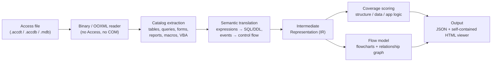
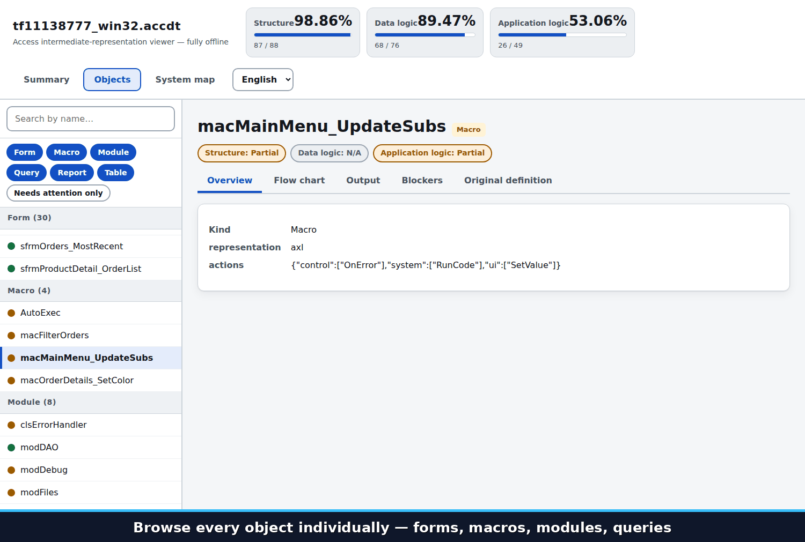

# access2flow

**Unlock Microsoft Access systems for modern code migration** — an open-source tool that analyzes Access databases completely offline and visualizes the application logic so you can understand and modernize legacy systems with confidence.

---

## What it does

### Core capabilities

- **Complete offline analysis** — Analyze Access files (`.accdt`, `.accdb`, `.mdb`) without ever launching Access, COM, or executing VBA/SQL. Your data never leaves your machine.
- **Visualize as flowcharts** — Complex procedures, macros, and data workflows become clear control-flow diagrams with color-coded branches, loops, and error handling.
- **See what can't translate** — Unsupported syntax is explicitly flagged with reason codes and context, so you know exactly what needs manual work.
- **Review by object** — Inspect each table, query, form, and procedure individually. See generated DDL/SQL, layouts, event mappings, and original definitions side by side.
- **Three-language UI** — Switch between **English / 日本語 / 中文** at any time with no re-analysis needed.

### Input/Output

| Input | What we read | What you get |
|---|---|---|
| `.accdt` | All object definitions in the package | Semantic translations: table DDL, query SQL, screen structure, macro/VBA control flow, and event mappings |
| `.accdb` (ACE 12/14/16/17) | `MSysObjects` only | Object inventory (name and type) |
| `.mdb` (Jet 4.0 / Jet 3.x) | `MSysObjects` only | Object inventory (name and type) |

We currently extract full definitions for 275 `.accdt` objects. See [docs/TRANSLATION_PROGRESS.md](docs/TRANSLATION_PROGRESS.md) for details.

---

## How the analysis works



Every step runs locally with the standard library only: nothing is executed, nothing is uploaded, and nothing is written outside the files you choose.

---

## Who should use this

- **Enterprises with sensitive data** — Analyze confidential Access systems without sending files over the network; run locally or on your own infrastructure.
- **Mid-market companies on a DX journey** — Plan migrations from Access to modern databases, understand system scope, and build handover documentation for developers.
- **Teams wanting a faster path forward** — Get a head start on rewriting Access logic; see which parts translate to SQL, which need app code, and which require design decisions.

---

## Try it now

### Browser version (easiest)

```bash
python -m converter.web --host 127.0.0.1 --port 8080
```

Open http://127.0.0.1:8080/, drag a `.accdt` file onto the page, and explore:



**What you're seeing above** (actual product UI, English locale):
1. **Object navigation** — every table, form, query, macro, and module listed and grouped by type in the sidebar; click any one to inspect it
2. **Flowchart view** — VBA and macro control flow rendered as a diagram, color-coded by decision / data / UI action / error handling
3. **Blockers view** — anything that could not be translated, with a reason code, the affected element, and a plain-language explanation of why

### Host it yourself (for your team)

```bash
gcloud run deploy access-to-flow --source . --region asia-northeast1 \
  --memory 1Gi --concurrency 4 --max-instances 3
```

Runs on Cloud Run's free tier for typical usage. See [docs/WEB_DEPLOYMENT.md](docs/WEB_DEPLOYMENT.md) for cost estimates, security hardening, and access controls.

### Offline CLI (for air-gapped systems)

```bash
# Translate and generate an offline HTML viewer
python -m converter translate input.accdt --output result.json --html result.html

# Regenerate the viewer from JSON
python -m converter ui result.json --output result.html
```

Full instructions in [docs/OFFLINE_CONVERTER_USAGE.md](docs/OFFLINE_CONVERTER_USAGE.md).

---

## How translation status works

Unlike a single pass/fail, we assess every object from **three perspectives**:

| Perspective | What it tells you |
|---|---|
| **Structure** | Can we read and parse the definition? |
| **Data processing** | Can it become SQL or a data model? |
| **Application processing** | Does it need app code, UI operations, or VBA? |

Each unsupported section gets a reason code and perspective assignment, so your team knows who handles the work: database engineers, application developers, or architects.

---

## Viewer features

- **Overall summary** — Translation coverage by concern, object counts, and unsupported reason codes with examples
- **Per-object details** — DDL, SQL, layout diagrams, event mappings, and original source
- **Control-flow diagrams** — Flowcharts for VBA, macros, and data macros (branches, loops, error handling, color-coded by type)
- **Relationship graph** — See how forms, queries, tables, procedures, and buttons connect
- **Three languages** — Japanese, English, Chinese; switchable anytime with no re-analysis

---

## Project layout

```
converter/
├─ __main__.py        CLI entry point
├─ access/            Binary format readers (Jet, ACE)
├─ semantics/         Semantic translation engine
├─ ir/                Intermediate representation and coverage tracking
├─ flow/              Control-flow model and graph rendering
├─ ui/                Single-file HTML viewer and localization
├─ web/               Lightweight hosted service (no framework)
└─ utils/             Normalization and utilities

docs/                  Deployment, progress, and technical reference
samples/               Open-source Access systems for validation
tools/                 Corpus testing and verification
```

---

## Quick start

### Requirements

Python 3.10+. Standard library only — no dependencies to install.

### Test it

```bash
# Run the full test suite
python -m pytest tests

# Or with standard library only
python tools/run_unittests.py
```

### Learn more

- [Offline usage and CLI options](docs/OFFLINE_CONVERTER_USAGE.md)
- [Hosting, costs, and security](docs/WEB_DEPLOYMENT.md)
- [Semantic translation reference](docs/SEMANTIC_TRANSLATION.md)
- [Translation progress by object type](docs/TRANSLATION_PROGRESS.md)

---

## Why completely offline?

Access files often contain sensitive data: customer information, financial records, proprietary logic. Running completely offline—no COM, no PowerShell, no network calls, no SQL or macro execution—means your data stays where you put it. When you need to share results, you control what leaves the machine: JSON, HTML, documentation, or nothing at all.
